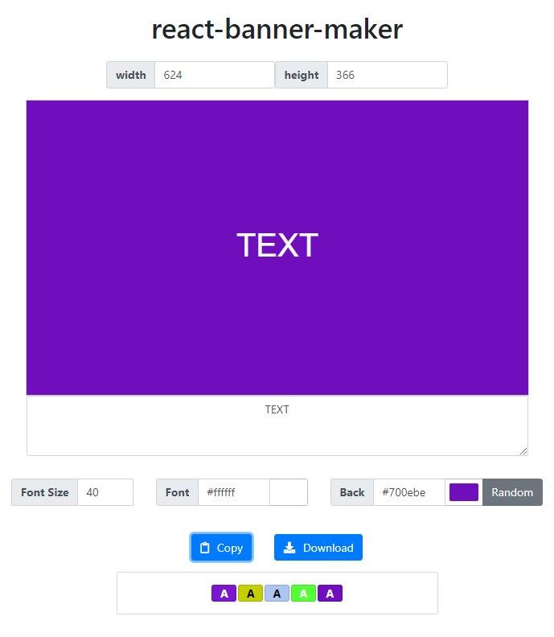

# react-banner-maker

- [Banner Maker](https://banner.godori.dev/)을 보고 만들어 보았습니다.
- html로만 만든 [html-banner-maker](https://github.com/chinsun9/html-banner-maker)를 리액트를 사용해서 다시 만들어 보았습니다.

## [데모](https://chinsun9.github.io/react-banner-maker/)

[](https://chinsun9.github.io/react-banner-maker/)

## 기능

- 캔버스 크기 조절
- 실시간 캔버스 업데이트
- 폰트 사이즈 조절
- 폰트색 조절
- 캔버스색에 따른 폰트색 자동조절
- 캔버스색 조절
- 랜덤 캠버스색
- 이미지로 다운로드
- 클립보드로 카피
- 컬러 히스토리 기능

<hr><hr><hr>

## create-react-app으로 프로젝트 생성

```
npx create-react-app . --typescript
yarn add redux react-redux @types/react-redux
```

## yarn add typesafe-actions

```cmd cmd
yarn add typesafe-actions
```

- typesafe-actions 설치해서 액션과 리듀서 편하게 만들기

## 프로젝트를 진행하면서 겪은 문제들..

### parsing error: cannot read property 'name' of undefined

```ts modules/history/index.ts
export { default } from './reducer';
export * from './actions';
export * from './types';
```

- 파일 분리를할 때 위 문법에서 lint 오류가 발생한다.
- 기존 `yarn.lock`파일을 삭제한다.

```json package.json
  "devDependencies": {
    "@typescript-eslint/eslint-plugin": "^2.23.0",
    "@typescript-eslint/parser": "^2.23.0"
  },
```

- 노드모듈 폴더를 삭제한다
- `npm i`로 다시 노드모듈을 설치한다.

- 나는 ts버전이 3.7이였는데, 이 경우 eslint를 2.23으로 다운그레이드하라고 한다.
- https://github.com/typescript-eslint/typescript-eslint/issues/1746
- https://stackoverflow.com/questions/60729199/react-typescript-line-0-parsing-error-cannot-read-property-name-of-undefine

### useEffect 사용해서 Canvas 초기화 및 업데이트 하기

- useEffect를 사용안하니까 처음 웹을 로딩했을때 캔버스 초기화를 못하는 문제가 있엇다.

### Type 'boolean' is not assignable to type 'never'.ts(2322)

```ts Canvas.tsx
const offsets = lines
  .map((_line, index) => index)
  .reduce((prev: any[], curr) => {
    const subtract = curr - mid;
    prev.push([subtract < 0, parseInt(subtract.toString(), 10)]);
    return prev;
  }, []);
```

- https://stackoverflow.com/questions/52423842/what-is-not-assignable-to-parameter-of-type-never-error-in-typescript
- prev배열타입이 never[] 이여서 값을 담을 수 없는 문제가 있었다.
- typescript에서 array api 쓰는법을 익혀야겠다.

### react Object is possibly 'null'. useref

```ts Canvas.tsx
const canvas = canvasRef.current;

const canvas = (canvasRef as any).current;
```

- 위처럼 하니까 안됬는데, 아래처럼 하니까 됬다.

### reactcss Type '{ position: string; zIndex: string; }' is not assignable to type 'CSSProperties'. Types of property 'position' are incompatible.

```tsx SettingCanvasDetail.tsx
      popover: {
        position: 'absolute',
        zIndex: 3 ,
      }  as CSSProperties,
```

- ` as CSSProperties`를 붙여주니까 잘 적용되었다.
- 또 zIndex의 값은 number로 줘야한다.

### 리액트 타입스크립트에서 프리티어 적용하기

- 으악

### 컬러픽커 알파값 못바꾸는 문제
